# smsRnalysis

Analysis of sms' written in R, using the datasets outputted by:
https://play.google.com/store/apps/details?id=com.riteshsahu.SMSBackupRestore

## Output

* Bar chart of frequent contacts
* For the most frequent contact
   * Comparison of number of texts sent and recieved
   * Comparison of length of text messages
   * Frequency of messages over time
   * Frequenct of messages by time of day
   * 'Emotion' comparison
   * 'Positivity' comparison


E.G.


# smsRnalysis

# Quick Summary

Analysis of sms' written in R, using the datasets outputted by:
https://play.google.com/store/apps/details?id=com.riteshsahu.SMSBackupRestore


```r
library("XML")
library("ggplot2")
library("forcats")
library("dplyr")
library("scales")

sms_path <- "sms-20170506101624.xml"

sms_raw <- xmlParse(sms_path)
sms_ns <- getNodeSet(sms_raw,"//smses/sms")

sms <- sapply(sms_ns, xmlAttrs)
sms_t <- as.data.frame(t(sms))
sms_t$body <- as.character(sms_t$body)
sms_t$date <- as.POSIXct(as.numeric(as.character(sms_t$date))/1000, origin="1970-01-01")
sms_t$contact_anon_full <- gsub("(.*) ([a-zA-Z]).*", "\\1 \\2***", as.character(sms_t$contact_name))
sms_t$contact_anon <- forcats::fct_lump(sms_t$contact_anon_full, n=15) %>% forcats::fct_infreq()
sms_t$contact_name <- forcats::fct_lump(sms_t$contact_name, n=15) %>% forcats::fct_infreq()

ggplot(sms_t, aes(x=type)) + geom_bar() +
  scale_x_discrete(labels=c("Recieved", "Sent")) + 
  ggtitle("Messages Recieved and Sent")
```

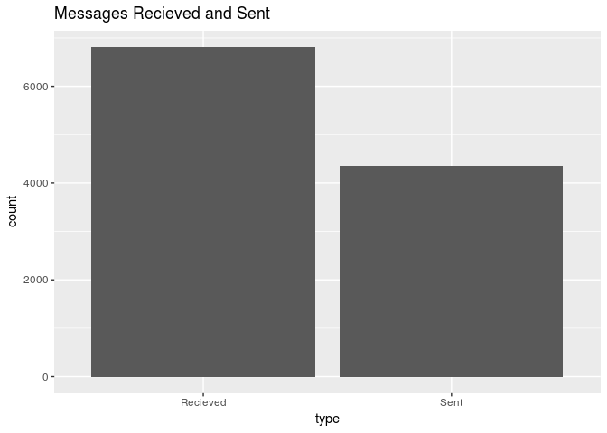<!-- -->

```r
ggplot(sms_t, aes(x=contact_anon)) + 
  geom_bar() + 
  theme(axis.text.x = element_text(angle=60, hjust=1)) + 
  ggtitle("Most frequent Contacts")
```

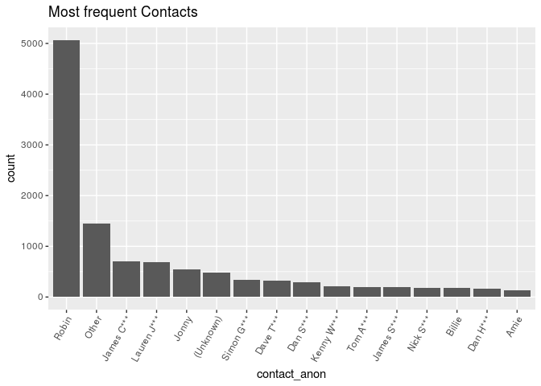<!-- -->

```r
dateBreakFormat <- "%Y-%m-%d"
ggplot(
  sms_t %>% group_by(
    day=as.POSIXct(strptime(strftime(date, format=dateBreakFormat), format=dateBreakFormat)),
    type=type) %>% summarise(count=n())
  , aes(x=day, y=count, color=type)) +
  geom_smooth(se = T) + 
  geom_jitter(size=0.2, width=0) +
  ggtitle("Texts by day") + 
  scale_color_discrete(labels=c("Recieved", "Sent")) #+ scale_x_datetime()
```

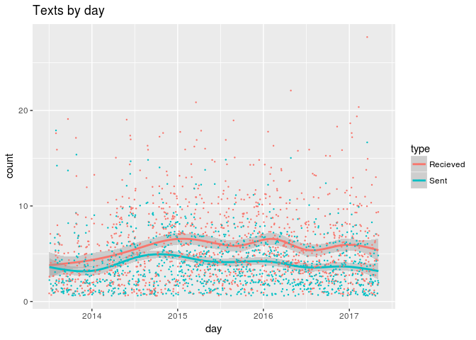<!-- -->

# Focus on most popular contact

```r
mostPopName <- levels(sms_t$contact_name)[1]
robin_msg <- sms_t %>% filter(contact_name==mostPopName)


ggplot(robin_msg, aes(x=type)) + geom_bar() +
  scale_x_discrete(labels=c("Recieved", "Sent")) + 
  ggtitle(paste0(mostPopName, " Messages by Sender"))
```

<!-- -->

```r
ggplot(robin_msg, aes(x=type, y=nchar(body))) + geom_col() +
  scale_x_discrete(labels=c("Recieved", "Sent")) + 
  ggtitle(paste0(mostPopName, " Characters sent by Sender")) +
  ylab("characters sent")
```

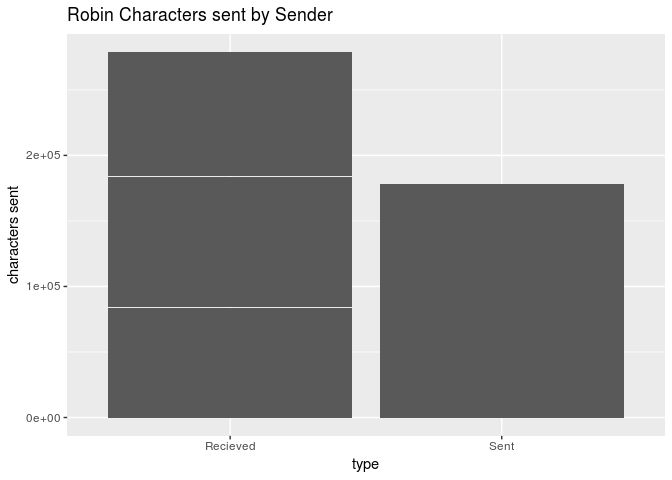<!-- -->

```r
ggplot(robin_msg, aes(x=type, y=nchar(body))) + 
  geom_violin(draw_quantiles = c(0.25, 0.5, 0.75), scale="count") + 
  scale_x_discrete(labels=c("Recieved", "Sent")) +
  ggtitle(paste0(mostPopName, " Message Length by Sender")) +
  ylab("Message Length")
```

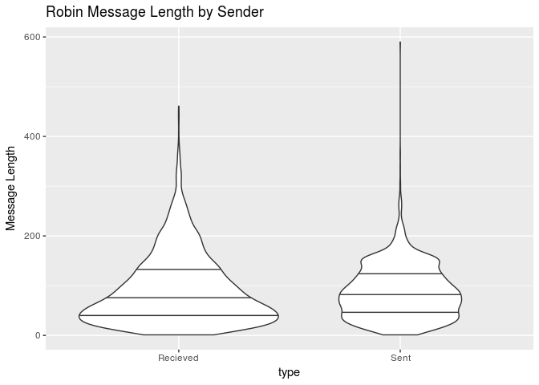<!-- -->

```r
dateBreakFormat <- "%Y-%m-%d"
ggplot(
  robin_msg %>% group_by(
    day=as.POSIXct(strptime(strftime(date, format=dateBreakFormat), format=dateBreakFormat)),
    type=type) %>% summarise(count=n())
  , aes(x=day, y=count, color=type)) +
  geom_smooth(se = T) + 
  geom_jitter(size=0.2, width=0) +
  ggtitle(paste0(mostPopName, " texts by day")) + 
  scale_color_discrete(labels=c("Recieved", "Sent")) #+ scale_x_datetime()
```

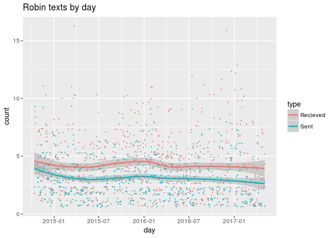<!-- -->

```r
timeBreakFormat <- "%I%M"

mornMap <- list("0"="AM", "1"="PM")
mornMap <- c(`0`="AM", `1`="PM")
mornLabeller <- function(variable,value){
  return(mornMap[value])
}

ggplot(
  robin_msg %>% group_by(
    day=as.POSIXct(strptime(strftime(date, format=timeBreakFormat), format=timeBreakFormat)),
    half= as.numeric(strftime(date, format="%H")) %/% 12,
    type=type) %>% summarise(count=n())
  , aes(x=day, y=count, color=type)) +
  geom_smooth(se = T) + 
  geom_jitter(size=0.2, width=0, height=0.4) +
  ggtitle(paste0(mostPopName, " texts by Time")) + 
  ylab("Texts per Minute") +
  scale_color_discrete(labels=c("Recieved", "Sent")) + 
  facet_wrap(~half, labeller = as_labeller(mornMap)) + 
  scale_x_datetime(date_labels="%I", date_breaks="1 hour") + coord_polar()
```

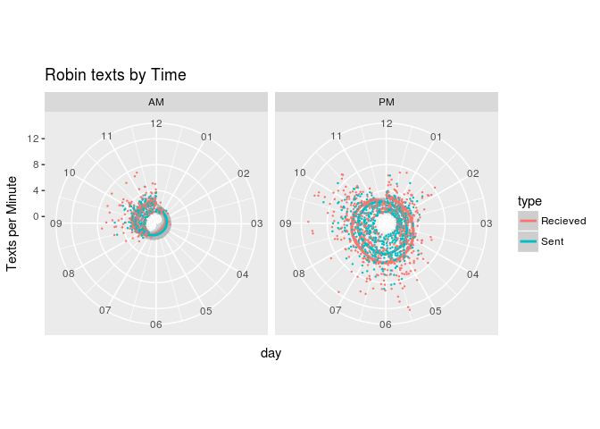<!-- -->

```r
  #scale_x_datetime("Time of Day", date_labels="%H:%M")

time24BreakFormat <- "%H%M"

ggplot(
  robin_msg %>% group_by(
    day=as.POSIXct(strptime(strftime(date, format=time24BreakFormat), format=time24BreakFormat)),
    half= as.numeric(strftime(date, format="%H")) %/% 12,
    type=type) %>% summarise(count=n())
  , aes(x=day, y=count, color=type)) +
  geom_smooth(se = T) + 
  geom_jitter(size=0.2, width=0, height=0.3) +
  ggtitle(paste0(mostPopName, " texts by Time")) + 
  ylab("Texts per Minute") +
  scale_color_discrete(labels=c("Recieved", "Sent")) + 
  #facet_wrap(~half, labeller = as_labeller(mornMap)) + 
  #scale_x_datetime(date_labels="%H:%M", date_breaks="1 hour") + coord_polar()
  scale_x_datetime("Time of Day", date_labels="%H:%M")
```

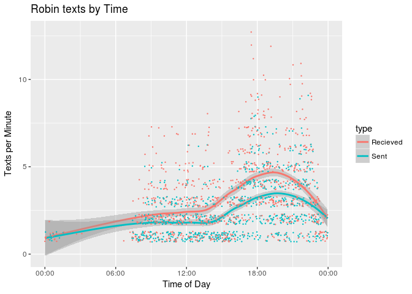<!-- -->

# Emotion and content of most popular contact

```r
library(sentiment)
library(wordcloud)

wordcloud(robin_msg$body)
```

<!-- -->

```r
#https://sites.google.com/site/miningtwitter/questions/sentiment/sentiment
class_emo = classify_emotion(robin_msg$body, algorithm="bayes", prior=1.0)
# get emotion best fit
emotion = class_emo[,7]
# substitute NA's by "unknown"
emotion[is.na(emotion)] = "unknown"

# classify polarity
class_pol = classify_polarity(robin_msg$body, algorithm="bayes")
# get polarity best fit
polarity = class_pol[,4]

# data frame with results
sent_df = data.frame(text=robin_msg$body, emotion=emotion,
                     polarity=polarity, type=robin_msg$type, stringsAsFactors=FALSE)

# sort data frame
sent_df = within(sent_df,
                 emotion <- factor(emotion, levels=names(sort(table(emotion), decreasing=TRUE))))

ggplot(sent_df, aes(x=emotion, y=..count.., fill=type, group=type)) +
  geom_bar(position="dodge") + scale_fill_discrete(labels=c("Recieved", "Sent")) +
 # scale_fill_brewer(palette="Dark2") +
  labs(x="emotion categories", y="number of texts") +
  ggtitle(paste0(mostPopName, " Emotion"))
```

<!-- -->

```r
count_sent_df <- sent_df %>% group_by(type, emotion) %>% summarise(n = n()) %>% select(type, emotion, n)
count_sent_df$norm <- ave(count_sent_df$n, list(count_sent_df$type), FUN=function(L) L/sum(L))
#count_sent_df %>% group_by(type) %>% summarise(sum(norm))

ggplot(count_sent_df, aes(x=emotion, y=norm, fill=type)) +
  geom_col(position="dodge") + 
  ggtitle(paste0(mostPopName, " Emotion Normalised Percentage")) +
  scale_fill_discrete(labels=c("Recieved", "Sent"))
```

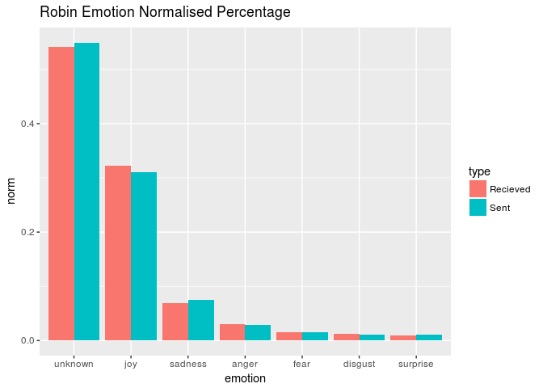<!-- -->

```r
ggplot(count_sent_df, aes(x=emotion, y=norm, fill=type)) +
  geom_col(position="fill") + 
  ggtitle(paste0(mostPopName, " Emotion Normalised Ratio")) +
  scale_fill_discrete(labels=c("Recieved", "Sent"))
```

<!-- -->

```r
ggplot(sent_df, aes(x=polarity, y=..count.., fill=type, group=type)) +
  geom_bar(position="dodge") + scale_fill_discrete(labels=c("Recieved", "Sent")) +
  # scale_fill_brewer(palette="Dark2") +
  labs(x="positivity categories", y="number of texts") +
  ggtitle(paste0(mostPopName, " Positivity"))
```

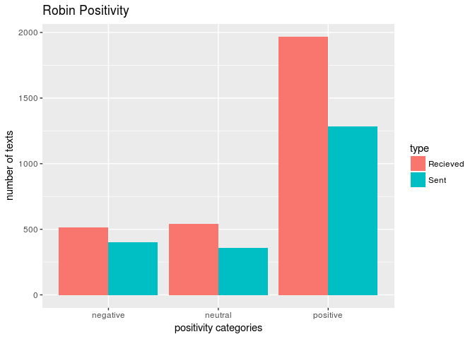<!-- -->

```r
ggplot(sent_df, aes(x=type, y=..count.., fill=emotion, group=emotion)) +
  geom_bar(position="fill") + scale_x_discrete(labels=c("Recieved", "Sent")) +
  # scale_fill_brewer(palette="Dark2") +
  labs(x="positivity categories", y="number of texts") +
  ggtitle(paste0(mostPopName, " Emotion"))
```

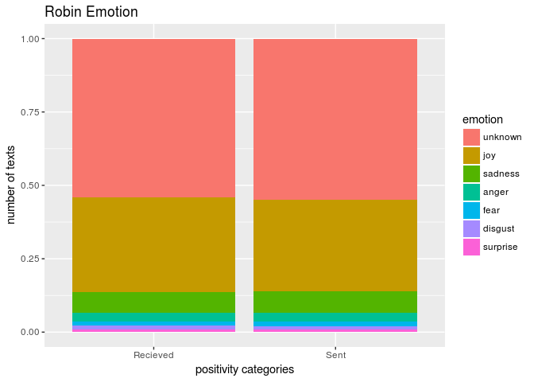<!-- -->

```r
ggplot(sent_df, aes(x=type, y=..count.., fill=polarity, group=polarity)) +
  geom_bar(position="fill") + scale_x_discrete(labels=c("Recieved", "Sent")) +
  # scale_fill_brewer(palette="Dark2") +
  labs(x="positivity categories", y="number of texts") +
  ggtitle(paste0(mostPopName, " Positivity"))
```

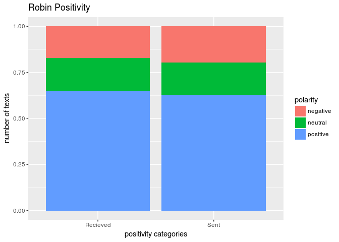<!-- -->

```r
ggplot(sent_df, aes(x=emotion, y=..count.., fill=type, group=type)) +
  geom_bar(position="dodge") + scale_fill_discrete(labels=c("Recieved", "Sent")) +
  # scale_fill_brewer(palette="Dark2") +
  labs(x="emotion categories", y="number of texts") +
  ggtitle(paste0(mostPopName, " Emotion"))
```

<!-- -->

```r
some_txt <- robin_msg$body
# separating text by emotion
emos = levels(factor(sent_df$emotion))
nemo = length(emos)
emo.docs = rep("", nemo)
for (i in 1:nemo)
{
  tmp = some_txt[emotion == emos[i]]
  emo.docs[i] = paste(tmp, collapse=" ")
}

# remove stopwords
emo.docs = removeWords(emo.docs, stopwords("english"))
# create corpus
corpus = Corpus(VectorSource(emo.docs))
tdm = TermDocumentMatrix(corpus)
tdm = as.matrix(tdm)
colnames(tdm) = emos

# comparison word cloud
comparison.cloud(tdm, colors = brewer.pal(nemo, "Dark2"),
                 scale = c(3,.5), random.order = FALSE, title.size = 1.5)
```

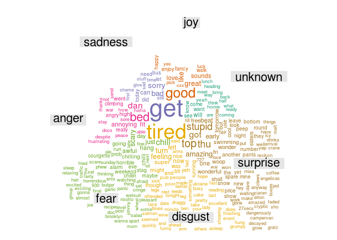<!-- -->

```r
#install_url("http://cran.r-project.org/src/contrib/Archive/sentiment/sentiment_0.2.tar.gz")
#install_url("https://cran.r-project.org/src/contrib/Archive/slam/slam_0.1-37.tar.gz")
#install_url("http://cran.wustl.edu/src/contrib/Archive/Rstem/Rstem_0.4-1.tar.gz")
```
